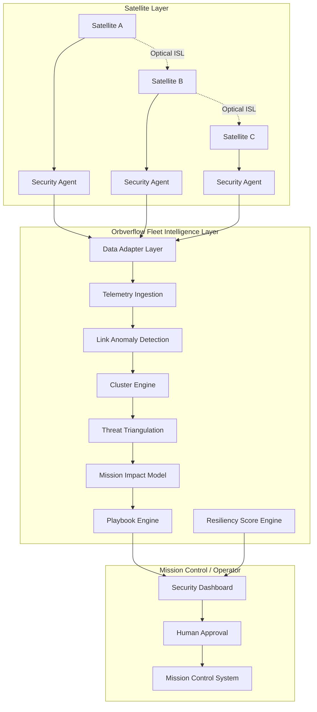

# Orbverflow (Demo)
**Distributed Space Network Defense Platform**  
Fleet-level cooperative detection + resilience playbooks for satellite constellations.

> Upgrade satellite defense from **standalone mode** to **cooperative mode** — with **Human-in-the-loop** and **Non-intrusive** integration to existing Mission Control Systems (MCS).

---

## What this demo shows

This repository contains a demo prototype for **Orbverflow**, focusing on:

- Fleet dashboard (satellite map + health)
- Dynamic **cluster view** (multi-satellite correlation)
- **Spatial consistency check** (anomaly correlation)
- Optional **threat triangulation** (conceptual module)
- **Playbook recommendations** (YAML DSL)
- Approval workflow (Human-in-the-loop)
- MCS integration stub (no direct satellite control)
- Resiliency Score (0–100)

**Goal:** Demonstrate how a constellation can remain operational under **wideband jamming / link degradation** conditions via **network-level resilience**.

---

## Product positioning (one-liner)

**Orbverflow is a Fleet Security Intelligence + Mission Resilience Orchestration Layer for space networks.**

Not:
- an anti-jam hardware module
- an RF signal processing product
- a satellite controller

Yes:
- a **fleet-level** decision platform that correlates multi-satellite telemetry and produces **auditable playbooks**.

---

## Architecture

### High-level (3 layers)

