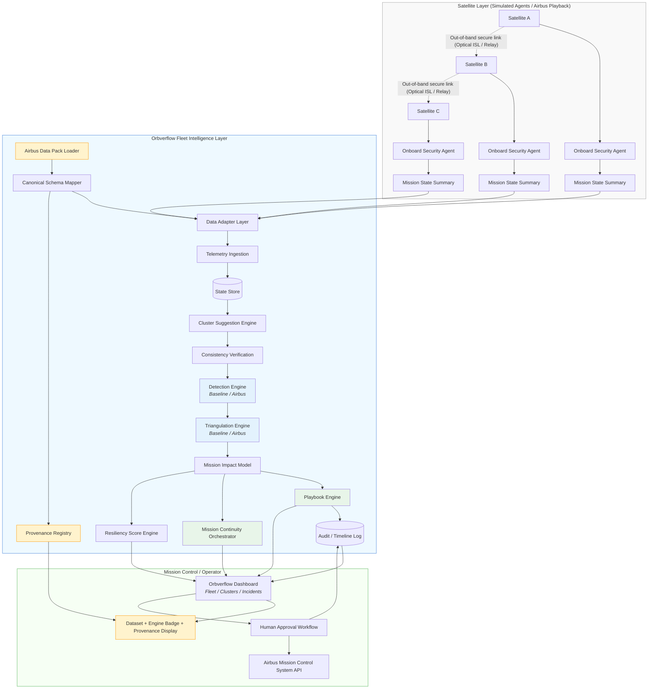
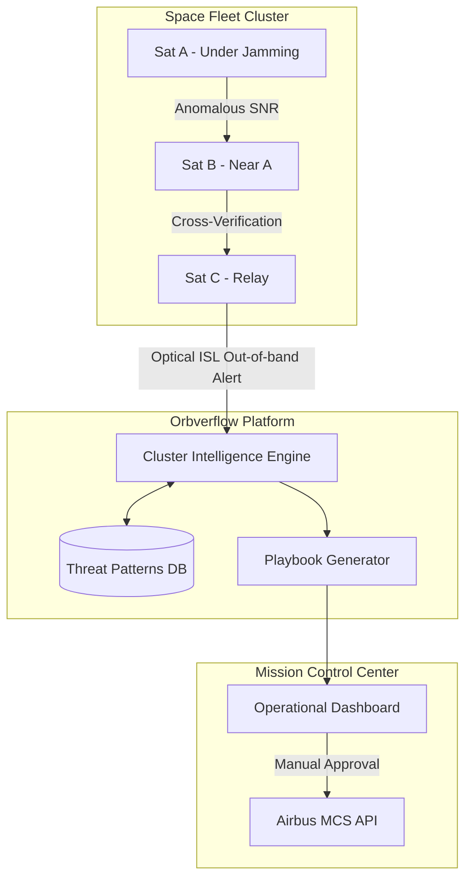

# Orbverflow Demo High Level Design (HLD) – ActInSpace 2026

:::success
- **Version** : v0.2.2 (Demo-focused + Airbus Pack integration)
- **Scope**: Hackathon demo (Taiwan Ku-band Jamming + SatB失效 + 3 Playbooks + Airbus data/patent-ready )
- **Goal**: 展示 Orbverflow 作為「Fleet Security Intelligence + Mission Resilience Orchestration」的最小可行系統（MVP Slice）並可快速接入 Airbus 釋出的 space data + patent methods

:::

:::info
Ref:
- 需求規格書: https://hackmd.io/@Kevinneck/BkOehvXrZx
:::

[TOC]


# 1. Demo 目標與成功標準
## 1.1 Demo 目標（What judges should “see”）

1. 控制台能即時看見整個星群狀態（健康、鏈路品質、事件）
2. 系統能自動建議衛星分群（cluster suggestion）
3. 系統能在情境注入後：
- 偵測 jamming（link degradation）
- 排除硬體故障（consistency check）
- 推估干擾位置/半徑/可信度（triangulation）
- 推薦 Playbook-04
4. 當 SatB 失效，系統能：
- 啟動 Playbook-07：Mission continuity
- 做 mission state summary replication （signed + anti-replay）
- 選出替代衛星（SatA/SatC）
- 顯示「需要 MCS 核准」
5. 額外展示 Playbook-06：Spoofing quarantine（可以用第二段情境或按鈕觸發）
6.  Airbus Pack 可視化證明
- UI 顯示：正在使用的 AIRBUS Dataset 與 Provenance（資料來源檔案/版本）
- UI 顯示：Triangulation/Detection 引擎為 Baseline / Airbus Patented（可切換或標記）

## 1.2 成功標準（Demo KPIs）
- 偵測/建議時間：秒級（UI 立即可見）
- Triangulation：能輸出 (lat, lon, radius, confidence)
- Availability：顯示在 80% loss 下仍保持 “degraded but running”
- Audit：事件鏈（timeline + hash/signature marker）可查
- Airbus data usage proof：每個 incident 可追溯到 Airbus pack 檔案/欄位

# 2. 系統分層架構（Demo版)

```
Satellite Layer (simulated agents + optional Airbus data playback)
        ↓ (telemetry/events)
Fleet Intelligence Layer (Orbverflow Core + Airbus Integration Layer + Pluggable Engines)
        ↓ (recommendations + clusters + reports)
Mission Control / Operator Layer (UI + human approval simulator + Airbus provenance display + MCS integration)
```

系統架構圖




## 2.1 Control Plane vs Data Plane

Orbverflow 在設計上明確分離兩個平面：
| Plane         | 說明                                                      |
| ------------- | ------------------------------------------------------- |
| Data Plane    | RF payload links, telemetry downlink                    |
| Control Plane | Out-of-band secure channel（Optical ISL 或受保護 relay link） |

> 在國家級干擾下，Data Plane 可能嚴重退化，但 Control Plane 仍維持可用，用於事件回報、狀態同步與 playbook 協調。


此設計對齊 Airbus「Sovereign Connectivity」與軍規系統韌性架構


# 3. Satellite Layer（衛星層）— Demo 技術規格
## 3.1 元件（Components）
- Satellite Telemetry Simulator (N satellites)
    - 5 顆 LEO 衛星：SatA~SatE
- Onboard Security / Mission Telemetry Agent（邏輯元件）
    - 實際系統：部署於衛星 OBC（onboard computer）
    - Demo：以軟體模擬
    - 生成 telemetry / link metrics / mission state summary
    - 接收 playbook “delivery” 事件（模擬 out-of-band）
> Agent 只負責回報 / 接收建議 / 產生摘要，並不直接執行控制 (由 MCS/ flight rules 決定)
- Out-of-band channel module（概念性：ISL / secure relay）
- Mission State Summary publisher
- Airbus Playback Mode（可選）
    - 若 Airbus 提供衛星或太空資料（telemetry / link logs / events），可用「回放」方式當作衛星輸出來源
    - 回放不改變核心架構，只替換資料來源
## 3.2 輸入/輸出（Data I/O）
Telemetry/Link metrics（每 1s 或 2s 一筆）
最小欄位：

- `timestamp`
- `sat_id`
- `lat`, `lon`, `alt`（可用 TLE propagate 或直接 mock）
- `snr_db`
- `rssi_dbm`
- `packet_loss_pct`
- `modem_reset_count`
- `power_watt`（可選）
- `link_state`（OK / DEGRADED / DOWN）
- `provenance` 
    - `source_vendor`, `source_dataset_id`, `source_file`, `source_fields`

Mission State Summary（每 5–10s 一筆，或事件時送）
> 最小必要資訊、不含 payload raw data
- `timestamp`
- `sat_id`
- `mission_mode`（e.g. IMAGING / RELAY / IDLE）
- `queue_depth`
- `cmd_seq_hash` (hash of last approved command sequence (metadata only))
- `time_window（start/end）`
- `capability_tags`（e.g. imaging, relay, geo_relay_ok）
- `signature`（demo 可用 HMAC）
- `anti_replay`（sequence/nonce）
- `provenance` 
    - `source_vendor`, `source_dataset_id`, `source_file`, `source_fields`


Out-of-band channel（模擬）
- Demo 只需要概念：`oob_available=true/false` + “delivery success”
- 不需真實 optical link，只需顯示：「帶外通道仍可用」

> 但可能還是要理解真實世界鏈路選項
> Ex.Optical ISL、受保護 S-band TT&C、GEO relay、或現有 protected gateway。


## 3.3 Multi-Orbit Orchestration

Orbverflow 支援異質星群（LEO / MEO / GEO）：
- LEO：高頻率觀測與異常感測
- GEO：高可用協調節點與帶外控制平面 relay

> 在大範圍地毯式干擾（數百至數千公里）下，LEO 可能同時失聯，GEO 可作為 control-plane anchor 確保協調不中斷。

# 4. Fleet Intelligence Layer（Orbverflow Core）— Demo 技術規格
## 4.1 核心模組（Modules）
### 4.1.1 Ingestion & State
1. Ingestion Service
- 接收 telemetry / mission summary（HTTP/WebSocket/MQ）
2. State Store
- 儲存最新衛星狀態 + 過去 5–10 分鐘時間序列（demo window）
### 4.1.2 Airbus Integration Layer
> 目的：讓你在拿到 Airbus data/patent pack 的 30 分鐘內能接入並在 UI 上證明「有使用」

3. Airbus Data Pack Loader
- 支援離線檔案：CSV / JSON / log（可擴充 PCAP）
- 讀取 Airbus pack → 轉換為 Orbverflow Canonical Schema
- 產出 provenance metadata（來源檔名、版本、欄位對應）
4. Canonical Schema Mapper
- 定義 Orbverflow 內部通用資料格式（見 4.2）
- 將 Airbus 欄位映射到：
    - TelemetryRecord / LinkMetricRecord / EventRecord
5. Provenance Registry
- 保存 dataset_id、file list、mapping version
- 每筆資料都帶 provenance，供 UI 與 audit 查詢

**最小 API（讓工程落地、且可 demo Airbus-proof）**
- `GET /meta/dataset` → `{source_vendor, source_dataset_id, mapping_version, files[]}`
- `GET /incidents/{id}` → `incident + provenance + engine_type`

### 4.1.3 Analytics & Decision （可並行/可組合）

6. Cluster Suggestion Engine
- 自動建議 “群組”（根據地理鄰近 + link health 相似性）
- Output (demo 友善):
    - `cluster_id`, `members[]`, `reason`（proximity / similar loss spike）
7. Consistency Check Engine
- 當一顆衛星異常時，對比同群其他衛星趨勢
- 目的：
    - 排除單點硬體故障
    - 可用於 spoofing 輔助判斷 （一致性與因果合理性）
    - 降低誤報率
| 條件                        | 事件等級            |
| ------------------------- | --------------- |
| 1 satellite anomaly       | Suspicious      |
| ≥3 satellites same region | Confirmed       |
| multi-orbit corroboration | High confidence |

8. Jamming Detector (Pluggable)
- Baseline（demo）：packet_loss 高 + SNR drop + 多顆同時發生
- Baseline 保底可跑；Airbus patented detection 到手後可替換（見 4.3）
9. Triangulation Engine（Pluggable）
- 依不同衛星的干擾強度差 + 位置 → 推估干擾中心點與半徑
- baseline triangulation + 可替換 Airbus patented triangulation
10. Playbook Engine
- 輸出建議 + 需要核准
- 管理 playbook 狀態機（PROPOSED → APPROVED → EXECUTED）
- Standardized Command Snippets
> Playbook 會產生符合 Airbus MCS 介面的「標準化指令片段」，供操作員審查後提交，不由 Orbverflow 直接執行。
11. Mission Continuity Orchestrator
- SatB link DOWN（或 mission link unavailable）時觸發
- 讀取 mission summaries → 選出候選替代衛星 → 建議切換窗口
- 只輸出 Switch Plan Recommendation；執行由 MCS 核准按鈕模擬（避免被誤解為控制/偏題）
12. Audit & Timeline
- 每個事件/建議都寫入 event log（可用 hash chain 模擬不可竄改）
- UI 可視覺化（timeline + marker，Provenance 綁定）

## 4.2 Canonical Schema（內部通用資料格式）
> 目的不是「完美」，而是：能快速把 Airbus pack 轉進來、跑得起來、並且可追溯（Airbus-proof）。

### 4.2.1 Dataset Metadata

- `source_vendor`：`AIRBUS` / `SIM`
- `source_dataset_id`：例如 `AIRBUS_PACK_2026_TW_01`
- `source_file`：`telemetry.csv` / `events.json`
- `source_fields`：`["snr","loss","..."]`
- `mapping_version`：`v0.1`

### 4.2.2 TelemetryRecord（Canonical）

- `timestamp`
- `sat_id`
- `position` {`lat`, `lon`, `alt`}
- `metrics` {`snr_db`, `rssi_dbm`, `packet_loss_pct`, `modem_reset_count`, `power_watt`}
- `link_state`
- `provenance`（Dataset Metadata）

### 4.2.3 EventRecord（Canonical）

- `timestamp`
- `sat_id(s)`（可多顆）
- `event_type`（JAMMING_SUSPECTED / SPOOFING_SUSPECTED / LINK_DOWN / INTRUSION_SUSPECTED）
- `event_payload`
- `provenance`

> 這個 schema 的目的不是「完美」，而是：能快速把 Airbus pack 轉進來、跑得起來、並且可追溯。

## 4.3 Pluggable Engines(專利技術接入方式)
### 4.3.1 為什麼要 Pluggable

你無法事先知道 Airbus 專利包提供的是：公式、流程、特徵萃取、模型、或 scoring method。
所以我們把核心偵測/定位/評分抽象成可替換引擎，做到：

- Baseline 一定能跑 demo
- Airbus patent 方法到手後可插拔替換
- UI 可顯示「目前使用 Airbus patented engine」

### 4.3.2 Engine Interfaces（最小介面）

- `DetectionEngine.detect(records) -> alerts[]`
- `TriangulationEngine.triangulate(alerts, positions) -> {lat, lon, radius_km, confidence}`
- `ResiliencyScoreEngine.score(states, incidents) -> score`

### 4.3.3 Engine Implementations

- Baseline Engines（預設）
    - Rule-based jamming detector
    - Simplified triangulation
    - Simple resiliency score
- Airbus Patented Engines（可選）
    - AirbusDetectionEngine
    - AirbusTriangulationEngine
    - AirbusResiliencyScoreEngine

### 4.3.4 Engine Selection（Demo 用）
- 設定檔或 UI toggle：
    - `engine.triangulation = baseline | airbus`
    - `engine.detection = baseline | airbus`
- 若 Airbus pack 到手後來不及完全替換：
    - 至少在 UI 與 audit 中標記：`airbus_method_applied=true`（例如用到 Airbus 提供的參數/規則）

# 5. Mission Control / Operator Layer（UI / 操作層）— Demo 規格（Airbus-proof）

## 5.1 必備 UI 元件

Global Header
- Dataset Badge
    - `AIRBUS Data Pack: <source_dataset_id>``
    - 若用 SIM：`SIMULATED DATA`
- Engine Badge
    - `Triangulation: Baseline / Airbus Patented`
    - `Detection: Baseline / Airbus Patented`
Provenance Panel
- 在 Incident 詳情頁顯示：
    - `source_file`
    - `mapping_version`
    - `source_fields`
- 目的：評審問「你用 Airbus 哪些資料」→ 你點開就有證據

Fleet Overview

Cluster View

Incidents + Triangulation Map

Playbooks + Approval

Audit Log

## 5.2 Orbverflow 控制台必備頁面（Demo Minimum UI）
    

- Page A：Fleet Overview（總覽）
    - 地圖/地球視覺化（可簡化成 2D map）
    - 每顆衛星狀態卡：
        - SNR、loss、link state、health score、`source_vendor` （AIRBUS/SIM）
    - Incident banner（是否有事件）
    - “Start Demo Scenario” 按鈕（情境注入）
- Page B：Telemetry Explorer（單顆/群組）
    - 選 Sat / Cluster 後顯示最近 1–3 分鐘曲線：
        - packet_loss、SNR
    - 支援 “Compare within cluster”（同群對比）
- Page C：Clusters（群組）
    - Orbverflow 建議的 cluster 列表
    - 每群：
        - 成員、群組健康、區域（台灣上空）
    - “Accept cluster suggestion” 按鈕（可有可無）
- Page D：Incidents & Triangulation（事件中心）
    - 事件時間線（T+0/T+5…）
    - Triangulation 結果顯示：
        - 固定輸出欄位: `lat, lon, radius_km, confidence`
        - 地圖上圈出 radius
        - confidence bar
        - Provenance Panel + Engine Badge
- Page E：Playbooks（建議與核准）
    - 列出 PROPOSED playbooks
    - 顯示：
        - actions
        - safety impact（附錄F）
        - “Approve” 按鈕（模擬 human-in-the-loop）
    - Approve 後顯示：
        - “Sent via out-of-band channel (success)”
        - `delivery_status: PENDING/SENT/ACKED` （demo 用假資料也行）
        - “Executed by MCS (simulated)”
- Page F：Audit Log（稽核）
    - 事件與核准紀錄
    - 每筆 log 顯示 `source_dataset_id` 與 engine type
    - 每筆有 hash / signature 標記（demo 可用假值）


# 6. Demo 情境流程（主持稿/腳本，Airbus-proof）
## Scenario 1：台灣上空 Ku-band 飽和干擾 + SatB 失效
Demo 開場
- UI Header 顯示：AIRBUS Data Pack: ...（若現場拿到 Airbus pack 就用 AIRBUS，否則先用 SIM）
- Engine Badge 顯示 baseline（或已切換 airbus）

**T+0s**
5 顆衛星 link degradation → Fleet Overview 變黃

**T+5s**
Consistency check 排除硬體故障

**T+10s**
Incident = wideband jamming
Triangulation output + 地圖圈選 + confidence
（Incident detail 同時顯示 provenance）

**T+15s**
Playbook-04 PROPOSED → Playbooks 頁顯示（含 safety impact）

**T+18s**
SatB link DOWN → Playbook-07 PROPOSED（mission summary replication + candidates）

**T+30s**
Operator Approve → MCS 模擬執行
Audit log 顯示：dataset + engine + approval chain

## Scenario 2：Spoofing Suspected（Playbook-06）

- 按鈕注入 spoofing
- Consistency verification 觸發 → Playbook-06 PROPOSED
- Provenance 顯示該 spoofing 訊號來自 Airbus pack 或 SIM

# 7. 技術選型（Demo-friendly）

- Satellite Sim / Airbus Playback → Core：HTTP/WebSocket
- Core → UI：WebSocket
- Backend：FastAPI or Node/Express
- Store：in-memory 或 Redis
- Frontend：React + Vite；Mapbox/Leaflet；Recharts

# 8. MVP 任務切分（含 Airbus integration）
**必做（Must-have）**
- Satellite simulator（5 satellites + jamming injection + sat fail）
- Ingestion + state store
- Cluster suggestion （含 cluster reason）
- Detection + triangulation（baseline）
- Playbook-04/07 + approval UI
- Timeline + audit log
- Airbus Data Pack Loader + Canonical Mapper + Provenance display
    - 哪怕最後只有 “AIRBUS pack → canonical → UI badge/provenance”，也能證明使用官方資料

**加分（Nice-to-have）**
- Playbook-06 spoofing demo
- Engine toggle（baseline/airbus）
- Hash chain audit 視覺化

> Scope 對齊說明：Demo 聚焦 jamming + spoofing + continuity；intrusion/supply-chain 以資料模型 + audit/provenance readiness 呈現（不強做完整偵測）。

# 9. 風險與對策（含 Airbus pack）

| 風險                  | 對策                                                             |
| ------------------- | -------------------------------------------------------------- |
| Airbus pack 格式未知    | 用 Data Pack Loader + Mapper，支援 CSV/JSON/log，mapping 可在現場快速調整   |
| Airbus patent 方法太複雜 | Pluggable Engines：baseline 保底可跑；patent 到手後用介面替換或部分採用並標記        |
| 評審質疑是否用到 Airbus 資料  | UI 顯示 Dataset Badge + Provenance Panel + Audit provenance，一鍵證明 |
| TLE/propagate 太耗時   | 位置可 mock，只要在台灣上空移動即可；provenance 仍可顯示 AIRBUS pack               |

# 附錄：Triangulation（Demo Baseline / Airbus-ready）

**Baseline（一定能跑）**
- `intensity = norm(packet_loss) * 0.7 + norm(snr_drop) * 0.3`
- `center = weighted_avg(position, weight=intensity)`
- `radius = spread of affected sats`（規則估算）
- `confidence = affected_count + intensity_consistency`

**Airbus Patented（插拔）**
- 若 Airbus 提供：
    - 公式 / 模型 / 特徵萃取 → 封裝成 `AirbusTriangulationEngine`
    - 或提供參數/流程 → 用同介面接入，並在 UI 標記 engine type / `airbus_method_applied=true`

情境示意圖
